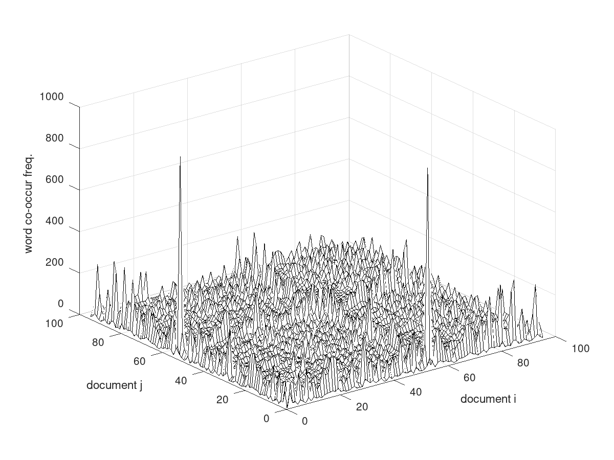
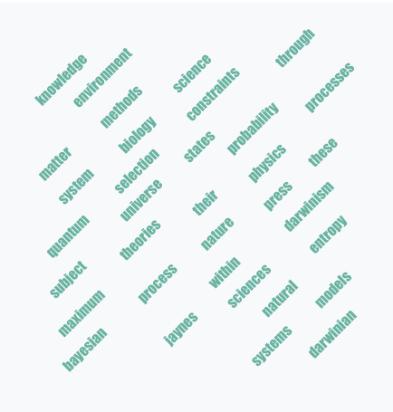
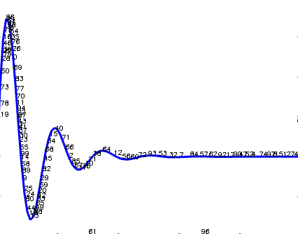
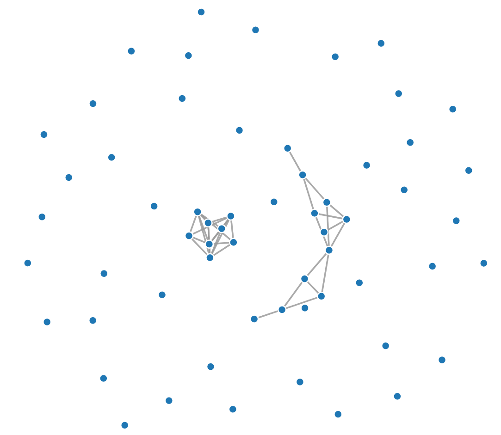

# plot2txt : software for extracting data from images

## Build

```
> sudo docker build . -t p2t:v1
```

## Examples

The docker image once built contains a limited selection of algorithms from a larger/older project that was dedicated to inferring data from technical images eg., 2d plots with linear scales. Key workflow steps include using OCR to convert linear scaling information to text. If x/y scales are created from OCR then a Gaussian mixture is used to model and invert pixel positions in the data region. For example, to analyze an input PDF document, identify and model any detected linear 2d plots, and create an output json document suitable for eg., indexing with elasticsearch:

```
> sudo docker run -i -v `pwd`:/home/ p2t:v1 sh -c "/opt/bin/create_es_doc.sh /home/docs/1003.1007.pdf" > output.json
```

The output document has a fairly simple schema eg., continuing with the above example:

```
{
  "linplots": [
    {
      "images": [
      ],
      "gmm": {
        "page": "24",
        "models": [
          {
            "x": [
            ],
            "y": [
            ]
          }
        ]
      }
    },
    {
      "images": [
      ],
      "gmm": {
        "page": "26",
        "models": [
          {
            "x": [
            ],
            "y": [
            ]
          }
        ]
      }
    }
  ],
  "terms": [
  ],
  "frequencies": [
  ]
}
```
The linplots field contains models for accurately detected 2d plots, including the x/y coordinates of the guassians in the mixture (fixed to 100), as well as QC images in the images array, stored as base64 encoded images eg., to create a png :

```
cat output.json | jq .linplots[0].images[0] | sed 's/"//g' | base64 -d > qc.png

```

The output json also provides the page in the PDF where the plot was detected, as well as text sequences (words or character combinations referred to simply as 'terms') and their frequency.

If you want to ignore any text/frequency in a PDF document and focus on modeling/inverting data in 2d plots directly, you can use a single application that expects a PNG of the target plot eg.,

```
sudo docker run -it -v `pwd`:/opt/docs p2t:v1 sh -c "/opt/bin/sp2txt --im /opt/docs/line_plot_simple.png" > output.json

```

full options for the app:
```
sudo docker run -it -v `pwd`:/opt/docs p2t:v1 sh -c "/opt/bin/sp2txt --help"
```

The doc/files.txt text file contains a list of arxiv documents that were used during the following experiments.

Processing multiple documents using the wokflow creates output data suited to further analysis and visualization. For example, creating a measure that uses the term field, helps indicate the degree to which two documents are similar. The figure below shows this measure for document pairs, and in this test set documents 2 (https://arxiv.org/abs/1001.0061) and 54 (https://arxiv.org/abs/1001.0709) are most similar.



A simple and impactful view that can be created from output per document or all documents is a word cloud eg., below. Some workers prefer the lolliplot representation, owing to the tendency of word clouds to overemphasive large words, for instance : https://d3-graph-gallery.com/lollipop.html

 

 For this particular test set, on average one linear 2d plot was detected per document, which translates to about 100 2D datasets. Obviously this data can be used directly for modeling and related tasks, and a reminder that each json output contains a base64 encoded image showing where the inverted points lie on the input plot image:

  

Data inferred from 2d plots can be used to create a network of neighboring plots, where distance in the network corresponds to thresholded distances between x/y centroids of plotted data. In this way, neighbor datasets can be identified as well as outliers.



WJB 07/22
